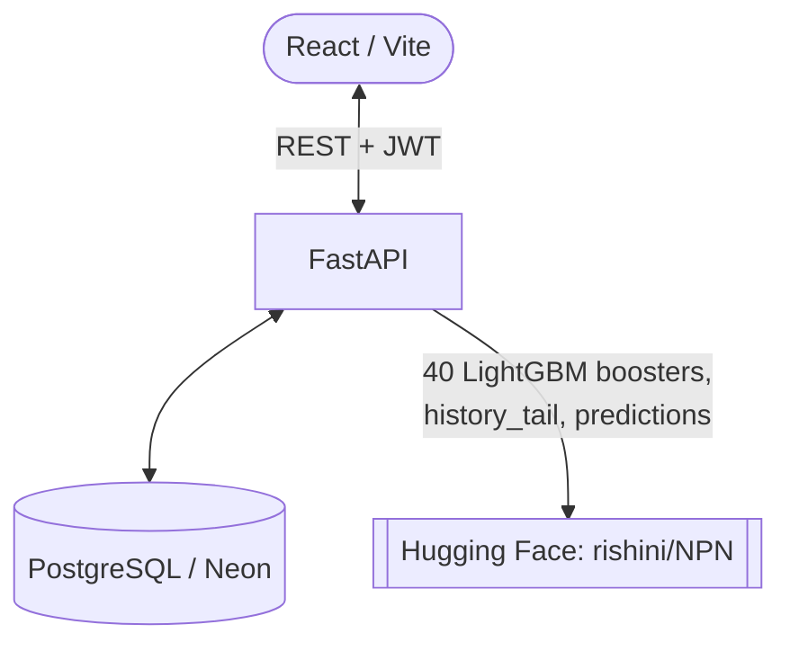

# M5 Forecasting Engine

A full-stack demand-forecasting platform over the [M5 Forecasting](https://www.kaggle.com/competitions/m5-forecasting-accuracy)
dataset: 28-day unit-sales forecasts per item per store, served from trained LightGBM models,
with a React dashboard and role-scoped access.

## The model

Forecasts come from **40 Tweedie LightGBM boosters** published at
[`rishini/NPN`](https://huggingface.co/rishini/NPN) — one per store (10) per horizon block
(days 1-7, 8-14, 15-21, 22-28). 34 features, validated at **WRMSSE 145.6** across three folds.

The forecast the API serves has two parts:

| Part | Source | Exactness |
|---|---|---|
| **Baseline** | `predictions.parquet` — the validated model output for all 30,490 series at forecast origin `d_1941` | Exact |
| **What-if** | The boosters run twice over the same feature rows, once with the user's price/SNAP override, and the ratio is applied | Model's own learned response |

The ratio approach exists for a reason. Nine features (`te_*`, `rolling_mean_60/180`,
`days_since_last_nonzero`, `weeks_since_release`, `price_vs_*`) are computed over the full
training history, which the published 57-day `history_tail.parquet` cannot reconstruct. They are
approximated — but because the approximation is identical in the numerator and denominator, it
cancels and does not bias the adjustment. The API reports which features were approximated in
`approximated_features`.

**Horizon is capped at 28 days.** That is exactly what the four blocks cover; there is no
30-day model.

`backend/tests/test_model_parity.py` runs the published parity fixture through the boosters and
asserts agreement to `< 1e-9`, so any drift in loading, feature order, or LightGBM version fails
in CI rather than silently producing wrong forecasts.

## Architecture



- **Frontend** — React 19, Vite, TypeScript, Tailwind, Recharts.
- **Backend** — FastAPI, psycopg2, PyJWT, bcrypt.
- **Model** — LightGBM 4.5.0 (must match the training version), pandas, pyarrow.

## Getting started

### Prerequisites
- Python 3.11+
- Node.js 18+
- A PostgreSQL database (Neon works well)

### Backend

```bash
cd backend
python -m venv venv
source venv/Scripts/activate   # venv/bin/activate on macOS/Linux
pip install -r requirements.txt
cp .env.example .env           # then fill in DATABASE_URL and JWT_SECRET_KEY
```

Seed an admin and real M5 sales — no Kaggle download needed, the data comes from the model's
own history file:

```bash
python scripts/seed_admin.py
python scripts/seed_data.py --source npn --stores CA_1 CA_2 TX_1 --items 200
```

Run it:

```bash
uvicorn main:app --reload
```

### Frontend

```bash
cd react_frontend
npm install
npm run dev
```

### Tests

```bash
cd backend
pip install -r requirements-dev.txt
pytest tests -v
```

## Seeding

One script, three sources — it always says which one it used:

```bash
python scripts/seed_data.py --source npn                     # real M5, no download (default)
python scripts/seed_data.py --source m5-csv --path <csv>     # real M5 from Kaggle CSV
python scripts/seed_data.py --source synthetic               # generated, clearly labelled
```

Useful flags: `--stores CA_1 TX_1`, `--items 200`, `--days 28`, `--no-truncate`.

## API

| Method | Path | Notes |
|---|---|---|
| `POST` | `/auth/login` | Returns a 24h JWT with role and store scope |
| `POST` | `/auth/create-user` | Admin only |
| `GET` | `/auth/users` | Admin only |
| `POST` | `/api/predict` | 1-28 day forecast; optional `price` / `is_snap_day` what-if |
| `GET` | `/api/model/info` | Status only — never triggers a model download |
| `GET` | `/api/model/feature-importance` | Global gain-based importance from the boosters |
| `GET` | `/api/model/explain` | Per-forecast SHAP drivers, in plain language |
| `GET` | `/api/model/features` | Plain-language description of all 34 features |
| `POST` | `/api/data/historical` | Real sales from the database |
| `GET` | `/api/data/price` | Real recorded `sell_price` for a series |
| `GET` | `/api/data/stores`, `/api/data/items`, `/api/data/store/{id}`, `/api/data/insights` | Scoped to the caller |

### Roles

`ADMIN` reaches every store. `STORE_OWNER` reaches only its assigned store — and a
`STORE_OWNER` with no assigned store reaches **nothing**, which is enforced in one place
(`utils/authz.py`) rather than repeated per route.

## Explainability

`/api/model/explain` answers "why this number?" using LightGBM's own SHAP contributions
(`pred_contrib=True`). These models use a Tweedie objective with a log link, so
`exp(base + Σ contributions)` reconstructs the prediction **exactly** — the attribution is not
a post-hoc approximation of the model, it is the model.

Working in log space also makes each driver readable as a multiplier:

```
A typical item at CA_1 averages 0.59 units/day.
  Avg sales, last 28 days     1.19x  increases
  Volatility, last 28 days    1.10x  increases
  Avg sales, last 180 days    1.08x  increases  (approx)
  Avg sales, last 7 days      1.05x  increases
-> 1.01 units/day for FOODS_1_001 at CA_1
```

Drivers marked **approx** are the features listed in `APPROXIMATED_FEATURES` — their direction
is reliable, their exact magnitude is indicative. Every feature also carries a human-readable
label and description (`backend/models/feature_glossary.py`), so the UI never shows a raw
identifier like `lag_7_div_rolling_28`.

## Accessibility

- Every form control has an associated `<label htmlFor>`, and inputs declare `autoComplete`.
- Errors render in `role="alert"` containers; status messages use `role="status"`.
- Forecast completion is announced through an `aria-live` region.
- Charts carry `role="img"` with a text summary, since the SVG itself conveys nothing to a
  screen reader. The explanation panel is a real list with text values rather than a chart.
- A "Skip to forecast" link, a labelled `<nav>`, and a `<main>` landmark support keyboard
  navigation.
- A visible focus ring is defined for all interactive elements — the dark theme had been
  relying on the near-invisible browser default.
- `prefers-reduced-motion` is honoured.

## Configuration

| Variable | Required | Notes |
|---|---|---|
| `DATABASE_URL` | yes | PostgreSQL connection string |
| `JWT_SECRET_KEY` | in production | Falls back to a public dev key and logs a warning |
| `CORS_ORIGINS` | yes in production | Comma-separated. Must be explicit — a wildcard is incompatible with credentialed requests |
| `NPN_REPO` | no | Defaults to `rishini/NPN` |
| `ENVIRONMENT`, `LOG_LEVEL`, `DB_POOL_MIN`, `DB_POOL_MAX` | no | |
| `SEED_ADMIN_EMAIL`, `SEED_ADMIN_PASSWORD` | no | Override the seeded admin account |

If you save `.env` from an editor that adds a UTF-8 BOM, that is handled — the loader reads it
as `utf-8-sig`.

## Deployment

`render.yaml` at the repo root deploys the backend (`rootDir: backend`). The frontend deploys to
Vercel from `react_frontend/` via `vercel.json`. Set `CORS_ORIGINS` on the backend to the
deployed frontend origin, and `VITE_API_URL` on the frontend to the backend URL.

## Voice assistant

`backend/routes/voice_routes.py` holds an unfinished Deepgram + OpenAI voice assistant. It is
**not mounted** in `main.py` and has no frontend client, so it does not run. Its dependencies
stay in `requirements.txt` so the module remains installable.
