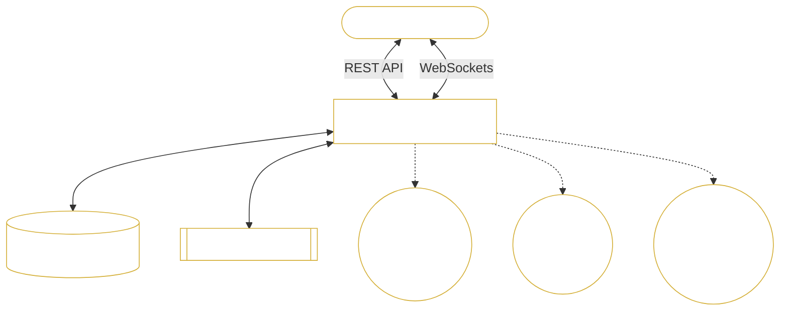

# M5 Forecasting Engine

An end-to-end, full-stack forecasting platform featuring real-time data visualization, predictive machine learning models, and an autonomous AI voice assistant named **Jade**.

## 🌟 Features

- **Predictive Engine**: Powered by LightGBM to accurately forecast item sales across different stores based on historical metrics, pricing, and external events.
- **AI Voice Assistant (Jade)**: A fully integrated, real-time voice assistant built with OpenAI (GPT-4o) and Deepgram (STT/TTS). Jade can analyze your data, remember conversational context, and execute machine learning predictions on your behalf through Tool Calling.
- **Modern UI**: A premium, responsive, glassmorphism-inspired React interface.
- **Robust Backend**: A high-performance FastAPI server managing REST endpoints, asynchronous WebSocket streams, and PostgreSQL databases.

## 🏗️ Architecture



## 🚀 Tech Stack

- **Frontend:** React, Vite, TypeScript, React Router, Recharts.
- **Backend:** Python, FastAPI, Uvicorn, Psycopg2.
- **Machine Learning:** LightGBM, Pandas, NumPy.
- **AI / Voice:** OpenAI (GPT-4o-mini), Deepgram (Aura TTS, Nova STT).
- **Database:** PostgreSQL (NeonDB).

## 🛠️ Getting Started

### Prerequisites
- Node.js (v18+)
- Python (v3.11+)
- A remote PostgreSQL database (like Neon)

### 1. Backend Setup
```bash
cd backend
python -m venv venv
source venv/Scripts/activate  # (or venv/bin/activate on Mac/Linux)
pip install -r requirements.txt
```

Create a `.env` file in the `backend/` directory with your API keys:
```env
DATABASE_URL=postgresql://...
GROQ_API_KEY=your_key
DEEPGRAM_API_KEY=your_key
OPENAI_API_KEY=your_key
JWT_SECRET_KEY=super-secret-default-key-for-dev
```

Start the FastAPI server:
```bash
uvicorn main:app
```

### 2. Frontend Setup
```bash
cd react_frontend
npm install
```

Start the Vite development server:
```bash
npm run dev
```

## 🧠 Meet Jade
Jade is not just a chatbot—she is integrated directly into the system's prediction layer. When connected to the WebSocket overlay, you can ask her to forecast sales:

> *"Jade, can you predict the sales for item FOODS_1 in store CA_1?"*

She will autonomously trigger the `predict_sales` tool, compute the numbers using the LightGBM model, and speak the results back to you instantly.
